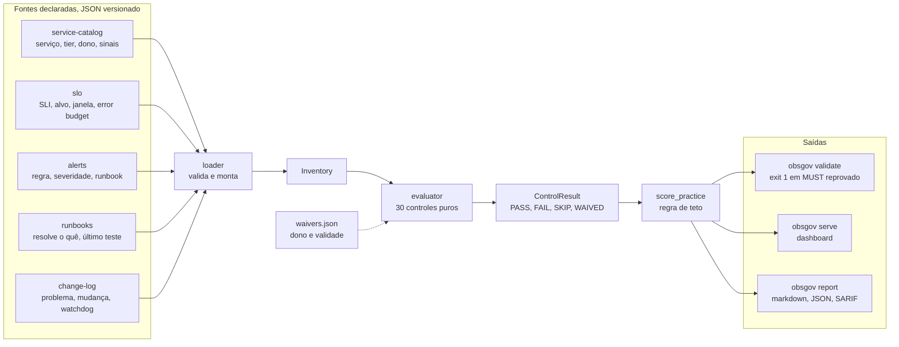
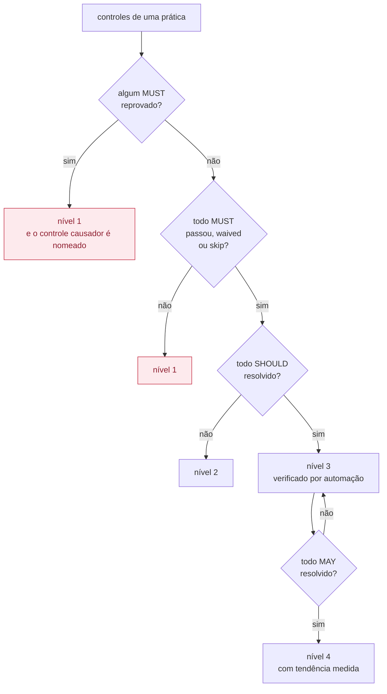

# observability-governance-lab

[](https://github.com/JulianoVinceCampos/observability-governance-lab/actions/workflows/pr-ci.yml)
[](https://sonarcloud.io/summary/new_code?id=JulianoVinceCampos_observability-governance-lab)
[](https://sonarcloud.io/summary/new_code?id=JulianoVinceCampos_observability-governance-lab)
[](https://scorecard.dev/viewer/?uri=github.com/JulianoVinceCampos/observability-governance-lab)
[](LICENSE)

**Transforma a configuração declarada de observabilidade num verdict de compliance
auditável, mapeado para práticas ITIL 4 e objetivos COBIT 2019, como controle
executável em vez de documento.**

```bash
docker compose up --build      # http://127.0.0.1:8000
```

No fixture que acompanha este repo:

> **30 controles, 16 deles obrigatórios (MUST), avaliados em milissegundos contra um
> inventário declarado, movendo os mesmos três serviços de uma maturidade medida de
> 1.0 para 2.71 ao fechar gaps nomeados e evidenciados.**

```
$ obsgov score data/bad-state
maturidade geral: 1.0 / 5
  change-enablement                nível 1  <- travado por CHG-001
  continual-improvement            nível 0
  incident-management              nível 1  <- travado por INC-001
  monitoring-and-event-management  nível 1  <- travado por OBS-001
  problem-management                nível 2
  service-continuity                nível 1  <- travado por BCP-001
  service-level-management          nível 1  <- travado por SLO-002

$ obsgov score data/good-state
maturidade geral: 2.71 / 5
  change-enablement                nível 3
  continual-improvement            nível 0
  incident-management              nível 3
  monitoring-and-event-management  nível 3
  problem-management                nível 3
  service-continuity                nível 3
  service-level-management          nível 4
```

`continual-improvement` fica no nível 0 nos **dois** estados, de propósito. `CSI-001`
(tendência de maturidade) e `CSI-002` (gaps anteriores fechados ou com waiver) precisam
de um `maturity_history`, ou seja, de uma segunda execução. Uma avaliação única de um
inventário novo ainda não tem histórico, então a prática corretamente reporta "dado
insuficiente" em vez de fabricar um pass. Rode `obsgov score` de novo depois de
alimentar o `maturity_history` com o relatório da execução anterior e ele se move.

## Por quê

A maioria dos times responde bem "o agente está instalado? o dashboard existe?".
Quase nenhum responde, com evidência, "prove que o SLO tem consequência quando o error
budget estoura, que todo alerta que aciona alguém tem um runbook que de fato resolve, e
que o próximo deploy que quebrar este serviço vai ser pego pela telemetria." Essa
segunda pergunta é a que aparece em auditoria, e costuma ser respondida com planilha
feita na véspera.

O jeito comum de "aplicar ITIL e COBIT" a um projeto é um documento afirmando
aderência: uma pasta `docs/` com prosa e uma matriz RACI. Isso é declaração, não
evidência, e não sobrevive a contato com quem já leu os frameworks. Então este repo
inverte. Todo controle é uma função pura `Inventory -> Verdict`, tem uma checagem
automatizada, e se não pode ser checado automaticamente não entra no catálogo.

**Aviso de marca:** ITIL® é marca registrada da AXELOS/PeopleCert, COBIT® da ISACA.
Este projeto não é afiliado, endossado ou certificado por nenhuma das duas. Ver
[NOTICE.md](NOTICE.md). Identificadores de prática e objetivo são usados só como ponto
de referência público, nenhum texto normativo é reproduzido, e nenhuma alegação de
conformidade é feita.

## Início rápido

```bash
git clone https://github.com/JulianoVinceCampos/observability-governance-lab
cd observability-governance-lab
make install
make report        # avalia os dois fixtures, escreve out/*/report.{md,json,sarif}
```

Zero dependência de runtime, mesma disciplina dos outros repos deste portfólio
([ADR-0001](docs/adr/ADR-0001-zero-runtime-dependencies.md)): o gate de CI precisa
rodar antes de qualquer coisa ser instalada, então ele depende só da standard library.

Sem `make`:

```bash
PYTHONPATH=src python3 -m obsgov.cli validate data/bad-state   # sai com 1
PYTHONPATH=src python3 -m obsgov.cli validate data/good-state  # sai com 0
PYTHONPATH=src python3 -m obsgov.cli score data/good-state
PYTHONPATH=src python3 -m obsgov.cli report data/good-state --out out/good
```

Contra o seu próprio inventário declarado, aponte qualquer subcomando para um diretório
com as cinco fontes JSON (`service-catalog.json`, `slo.json`, `alerts.json`,
`runbooks.json`, opcionalmente `change-log.json`). Ver `data/good-state/` para o
formato.

## Como funciona



O ponto de desenho que sustenta a tese: cada controle é uma função pura
`Inventory -> Verdict`. Não faz I/O, não altera o inventário, e não chama probe no meio
da checagem. Isso mantém todo controle testável isoladamente e torna a avaliação
determinística: mesmo inventário, mesmo verdict.

### A regra de teto, que é o que impede o score de mentir



Vinte caixinhas verdes não vencem uma obrigatória quebrada. Um score que não consegue
ficar baixo não mede nada.

**O avaliador não confia no arquivo declarado.** No M1, um sinal cujo nome bate com o
sentinela `UNVERIFIED_METRIC` é tratado como morto, seguindo a mesma disciplina de "só
entra o que responde" que inspirou este projeto. O M2 (ainda não construído) troca o
sentinela por um probe vivo contra um backend real, então um nome de métrica que não
resolve de fato reprova do mesmo jeito.

**A regra de teto** ([`score_practice`](src/obsgov/evaluator.py)) é a parte que mantém
o número de maturidade honesto: um único controle `MUST` reprovado trava a prática no
nível 1, não importa quantos controles `SHOULD`/`MAY` passem. Vinte caixinhas verdes
não vencem uma obrigatória quebrada. Testado explicitamente em
[`tests/test_evaluator.py::TestCeilingRule`](tests/test_evaluator.py).

**`SKIP` não é `PASS`.** Um controle cujo pré-requisito não foi satisfeito (por exemplo,
nenhum serviço crítico declarado ainda) é reportado como skip, com um motivo, e nunca
contado como pass. Juntar skip com pass é o jeito mais comum de um score de maturidade
mentir.

## Dashboard

O markdown responde bem "qual é o estado deste inventário". Responde mal "o que acontece
se eu tirar o runbook deste alerta". Para isso existe uma tela.

**Demo ao vivo: https://observability-governance-lab-v8yr.onrender.com**

Usuário `julianovincedecampos`, senha `2428c89d847bdae39201d42fd1bb8c8d`.

A credencial aparece publicada de propósito. O portão de sessão existe para a tela não
entregar dado sem autenticar, não para proteger segredo: o inventário por trás dele é
sintético e somente leitura, e a senha foi gerada só para esta instância, sem
reaproveitamento. A instância roda no plano free do Render e hiberna sem uso, então o
primeiro acesso pode levar perto de 50 segundos para acordar.

Local, com o pacote instalado:

```bash
obsgov serve data          # http://127.0.0.1:8000
```

Sem nenhuma variável no ambiente vale o default do código, `julianovincedecampos` e
`observability-governance-lab`, então a tela sobe sem configurar nada.

Seis views, na ordem em que a pergunta aparece:

- **Scorecard**, com maturidade por prática e, onde a prática está travada, o controle
  MUST responsável nomeado em vez de escondido num rodapé.
- **Controles**, filtrável por verdict, severidade e busca textual. Cada linha abre o
  detalhe com a evidência crua que o motor coletou e a remediação.
- **Matriz ITIL x COBIT**, heatmap de cobertura onde a célula mostra o pior verdict do
  cruzamento, porque um FAIL não deve desaparecer numa média. Célula hachurada significa
  que nenhum controle cruza ali, e mostrar o vazio vale mais que sugerir cobertura total.
- **Comparar estados**, com `bad-state` e `good-state` lado a lado e o delta por controle.
- **Editor de cenário**, a view que ensina a tese. Marque "remover a referência de runbook
  do alerta que pagina" e veja o `INC-001` ficar vermelho e a prática *incident
  management* despencar do nível 3 para 1 pela regra de teto, com todos os outros
  controles dela ainda verdes. A avaliação roda no servidor sobre o inventário que a tela
  envia, então nada altera o fixture em disco e duas abas não interferem uma na outra.
- **Evidência**, com download do relatório em markdown, JSON e SARIF.

O sistema de cor foi desenhado em torno da afirmação central do projeto: PASS preenchido
em verde, FAIL preenchido em vermelho, WAIVED contornado em âmbar, e **SKIP em cinza com
borda tracejada**, porque ausência de dado não pode parecer aprovação. Cor nunca carrega
significado sozinha: cada estado tem glifo e rótulo textual, então funciona em
monocromático e para quem não distingue verde de vermelho.

**Continua sem dependência de runtime.** O servidor é `http.server`, a sessão é `hmac`, o
frontend não tem framework nem CDN e não passa por build step.
[ADR-0002](docs/adr/ADR-0002-dashboard-na-stdlib.md) revisita o ADR-0001 e explica o que
foi preciso escrever à mão para justificar a decisão, incluindo os erros que ela permite
cometer.

A checagem de credencial acontece no servidor, com cookie assinado por HMAC. É um portão
de demonstração sobre dado sintético e somente leitura, não um controle de segurança, mas
um portão validado no navegador não seria portão nenhum.

## Container e deploy

```bash
docker compose up --build      # http://127.0.0.1:8000
```

A imagem não tem etapa de resolução de dependência, porque não há dependência a resolver.
Roda como usuário não-root e traz `HEALTHCHECK` batendo em `/api/health`. O blueprint do
Render (`render.yaml`) acompanha o repositório, com auto-deploy no push, e é o que sustenta
a [demo ao vivo](https://observability-governance-lab-v8yr.onrender.com). A porta não está
fixada em lugar nenhum: a plataforma injeta `PORT` e o default da CLI lê do ambiente.

`OBSGOV_PASSWORD` está declarado com `sync: false`, então o valor nunca entra no
repositório: ele é preenchido no painel da plataforma. O que está publicado na seção do
dashboard é a senha desta demo específica, escrita ali porque um link de demonstração que
ninguém consegue abrir não demonstra nada. O mecanismo continua sendo o mesmo que serve
para secret de verdade.

Monte o seu próprio inventário sobre `/app/data` para avaliar configuração real. O volume
é somente leitura, a ferramenta nunca escreve no inventário.

## O catálogo de controles

30 controles em 7 práticas, mapeados para 9 objetivos COBIT 2019. Tabela completa com
severidade, texto de remediação e justificativa de cada um em
[`docs/controls.md`](docs/controls.md). Resumo aqui:

| Prática | COBIT | MUST | SHOULD | MAY |
|---|---|---|---|---|
| monitoring-and-event-management | DSS01, MEA01 | 5 | 2 | 0 |
| service-level-management | APO09, MEA01 | 3 | 2 | 1 |
| incident-management | DSS02 | 3 | 2 | 0 |
| problem-management | DSS03 | 1 | 2 | 0 |
| change-enablement | BAI06, BAI10 | 2 | 2 | 0 |
| continual-improvement | APO11, MEA01 | 1 | 1 | 1 |
| service-continuity | DSS04 | 1 | 1 | 0 |

(16 MUST + 12 SHOULD + 2 MAY = 30 controles no total, 9 objetivos COBIT distintos.)

O que mais gente esquece é o `BCP-001`: tem algo vigiando o próprio pipeline de
observabilidade? Um pipeline sem heartbeat é um ponto cego que parece bem até ser
exatamente o motivo pelo qual ninguém foi acionado.

## Os dois fixtures

`data/bad-state/` e `data/good-state/` declaram os **mesmos três serviços**
(`app-tier-node`, `edge-proxy`, `rdbms-primary`, nomes genéricos, ver
[O fixture é sintético de propósito](#o-fixture-é-sintético-de-propósito)) em dois
estados. O ruim não é quebrado ao acaso: todo gap foi rastreado até um modo de falha
real, já diagnosticado antes, como um alerta sem runbook, um pipeline de log sem
`trace_id`, uma mudança sem sinal de rollback, zero watchdog no próprio pipeline.
`good-state` fecha cada um sem mudar o que os serviços são.
[`tests/test_fixtures_end_to_end.py`](tests/test_fixtures_end_to_end.py) garante tanto
as falhas específicas quanto que a maturidade geral de fato melhora entre os dois.

## O fixture é sintético de propósito

Os nomes de serviço (`app-tier-node`, `edge-proxy`, `rdbms-primary`) e o dataset são
100% sintéticos, sem relação com produto, cliente ou empresa real. Cada controle nasce
de um padrão de arquitetura genérico (nó de camada de aplicação, proxy de borda, banco
relacional), nunca de um sistema específico. Isso é imposto, não prometido:
`tools/sanitize_scan.py` bloqueia instance id, account id, CNPJ/CPF, IP privado e
hostname interno, e roda como o primeiro gate tanto local (pre-commit) quanto no CI.

## O que ainda não faz

- **Sondar um backend vivo.** O M1 avalia estado declarado e uma flag booleana de
  correlação. O M2 troca os dois por queries reais contra uma stack OTel Collector +
  Prometheus/Tempo/Loki, incluindo o teste de correlação de `trace_id` nos três
  pilares.
- **Detecção de drift** (`CHG-004`) e **razão de ruído de alerta** (`INC-005`) exigem
  probe vivo e ficam `SKIP` de propósito até o M2.
- **Persistir o histórico de maturidade.** O `CSI-001` e o `CSI-002` leem
  `maturity_history`, mas hoje quem alimenta esse campo é quem edita o inventário. Fechar
  o loop (o relatório de uma execução virar o histórico da próxima, automaticamente) é o
  próximo incremento barato.

## Desenvolvimento

```bash
make install   # extras de dev + hooks de pre-commit
make check     # sanitize + lint + testes, na mesma ordem do CI
make cov       # testes com coverage
```

## Documentação

| Documento | Conteúdo |
|---|---|
| [NOTICE.md](NOTICE.md) | Aviso de marca ITIL®/COBIT®, ler antes de assumir qualquer coisa sobre alegação de conformidade |
| [docs/controls.md](docs/controls.md) | Catálogo completo de controles: severidade, mapeamento COBIT, remediação |
| [docs/componentes.md](docs/componentes.md) | Os componentes, os diagramas, e o que cada aresta garante |
| [ADR-0001](docs/adr/ADR-0001-zero-runtime-dependencies.md) | Por que zero dependência de runtime |
| [ADR-0002](docs/adr/ADR-0002-dashboard-na-stdlib.md) | Por que o dashboard também é standard library, e o que isso custou |
| [SECURITY.md](SECURITY.md) | Política de segurança e as camadas de defesa, com as limitações declaradas |
| [CONTRIBUTING.md](CONTRIBUTING.md) | Como contribuir e o que o CI exige |
| [CHANGELOG.md](CHANGELOG.md) | Histórico de versões |

## A esteira

Dez camadas, em três estágios. `sanitize` roda antes de `lint` de propósito: violação de
estilo se corrige com um commit, identificador vazado em histórico público é permanente.

| Camada | O que faz |
|---|---|
| pre-commit | higiene, ruff, gitleaks, conventional commit, sanitize |
| sanitize | duas engines independentes mais gitleaks em todo o histórico |
| lint | ruff, actionlint, e checagem de que `docs/controls.md` não divergiu do catálogo |
| build-test | matriz 3.11 a 3.13, gate pelo exit code nos dois fixtures, dashboard subindo |
| coverage | cobertura com ratchet, o piso só sobe |
| SAST | Semgrep com SARIF, CodeQL em Python e JavaScript, bloqueante |
| SCA | pip-audit no ambiente real, dependency review no PR, Dependabot agrupado semanal, e checagem por máquina de que o ADR-0001 não foi violado |
| sonar | quality gate com `qualitygate.wait=true`, senão o gate é decorativo |
| docker | build do zero, healthcheck, e checagem de usuário não-root |
| supply chain | SBOM CycloneDX, atestação de proveniência, Scorecard |

O job `ci-status` agrega tudo num único check, então exigir na branch protection não
significa editar o ruleset a cada job novo.

## Licença

MIT. Ver [LICENSE](LICENSE).
