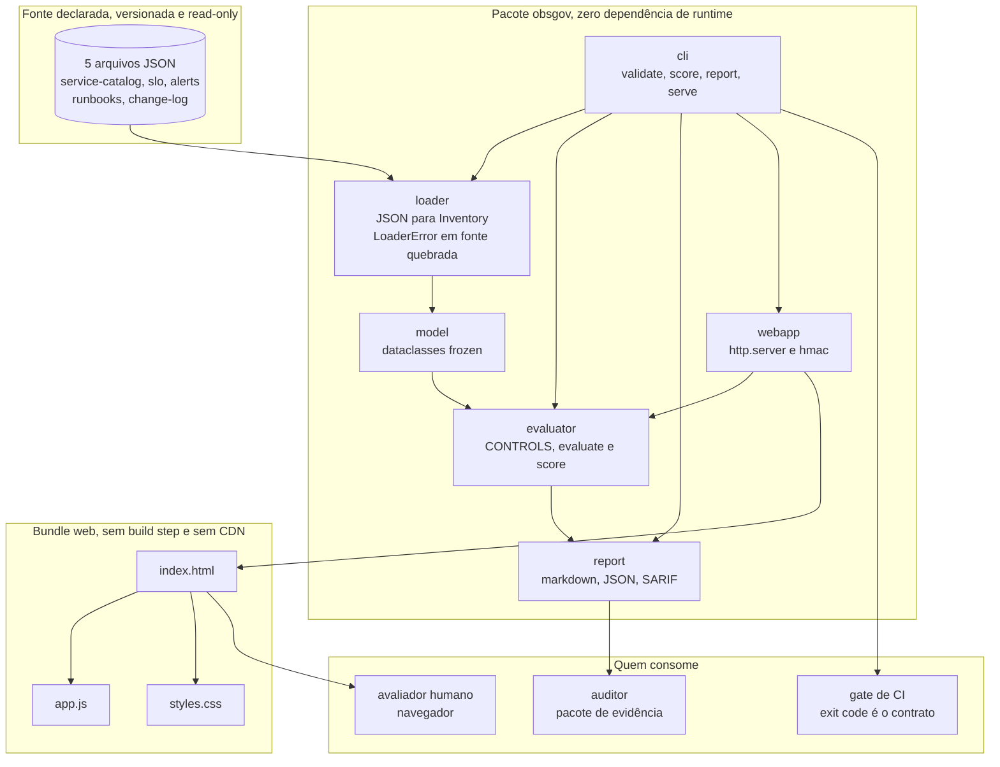
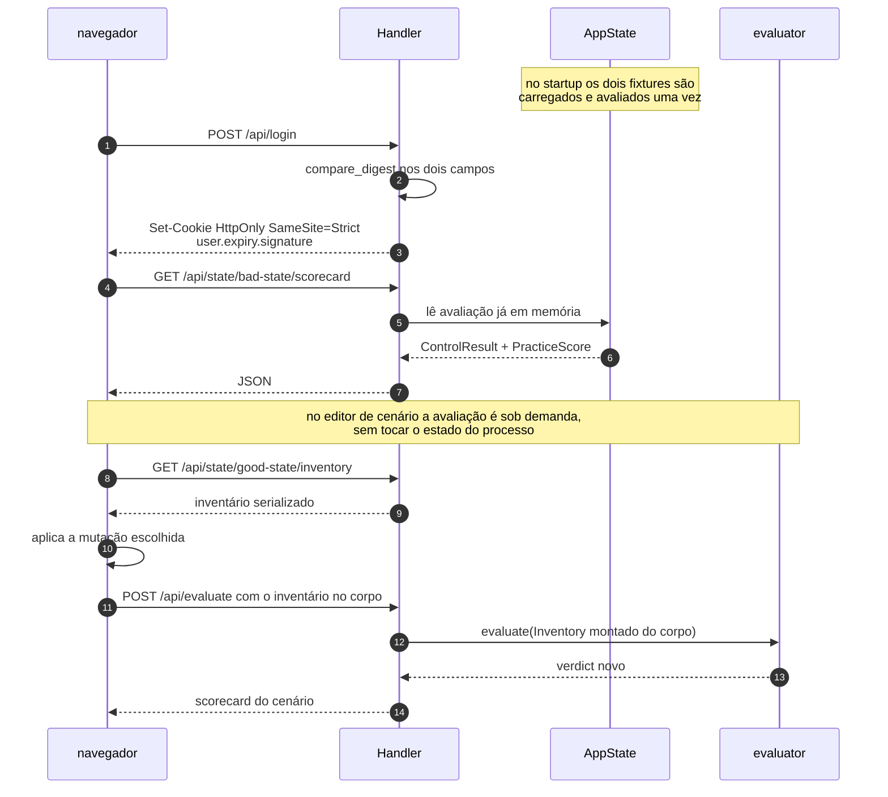

# Componentes

Os componentes, um diagrama por pergunta, e o que cada aresta garante.

## Visão de container

O que cada aresta garante:

- `loader -> model`: uma fonte obrigatória ausente ou JSON malformado vira `LoaderError`
  no nível do arquivo, não um `KeyError` no meio da avaliação. O arquivo opcional ausente
  degrada para tupla vazia, porque "ainda não declarei problema" é um finding para o
  avaliador, não um crash.
- `model -> evaluator`: o `Inventory` é `frozen`, então nenhum controle consegue alterar o
  estado que outro controle vai ler. A ordem de execução não muda o resultado.
- `webapp -> evaluator`: a mesma função `evaluate()` que a CLI usa. Não há segunda
  implementação, então dashboard e gate não podem divergir.
- `cli -> CI`: o exit code é o contrato. `validate` sai com 1 se qualquer MUST reprovar.

## Fluxo do dashboard

O editor de cenário recebe o inventário no corpo da requisição em vez de mutar o estado
do servidor. Duas consequências: o fixture em disco nunca é alterado, e duas abas abertas
não interferem uma na outra.

## Onde vive cada decisão

| Pergunta | Arquivo | Nota |
|---|---|---|
| O que é um controle | `evaluator.py`, tupla `CONTROLS` | 30 entradas, cada uma com id, severidade, prática, objetivo COBIT, título, remediação e função de check |
| Como um nível é calculado | `evaluator.py`, `score_practice` | a regra de teto vive aqui, não espalhada pelos controles |
| O que é um verdict | `evaluator.py`, enum `Verdict` | `PASS`, `FAIL`, `SKIP`, `WAIVED`. O valor do enum é contrato de saída, então não é traduzido |
| Como uma fonte é lida | `loader.py` | validação no nível do arquivo, não do campo. Ver ADR-0001 |
| Como o relatório é gerado | `report.py` | três formatos da mesma avaliação |
| Como a sessão é assinada | `webapp.py`, `make_session` | HMAC-SHA256, segredo por processo. Ver ADR-0002 |
| O que a tela mostra | `web/app.js` | funções de render que devolvem string, sem framework de reatividade |
| O sistema de cor | `web/styles.css`, bloco `:root` | tokens, e o comentário no topo explica por que SKIP é tracejado |

## Links

- [ADR-0001](adr/ADR-0001-zero-runtime-dependencies.md): por que zero dependência de runtime
- [ADR-0002](adr/ADR-0002-dashboard-na-stdlib.md): por que o dashboard também é standard library
- [controls.md](controls.md): o catálogo completo, gerado do código
